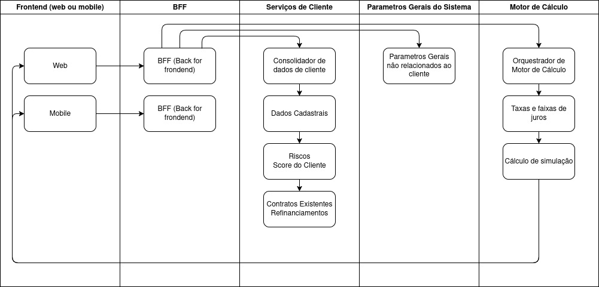
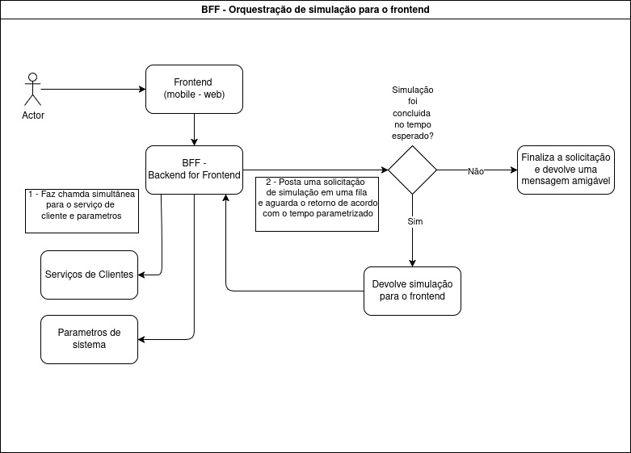
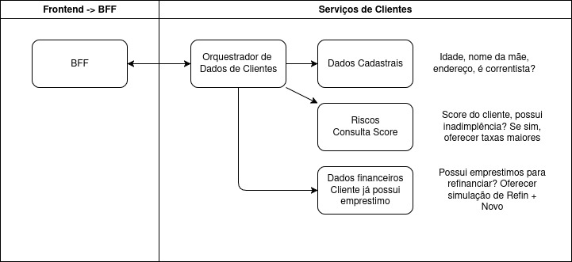
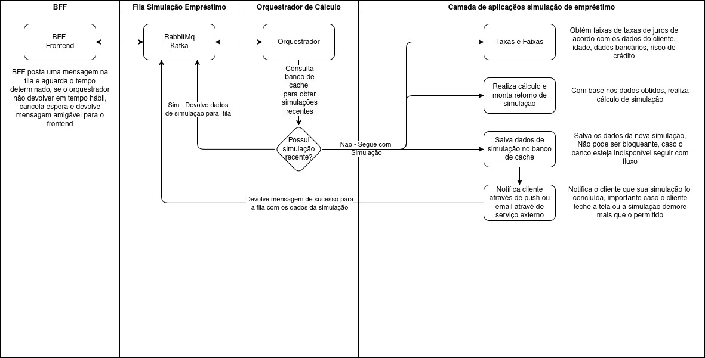

## System Design - Serviços de Simulação de Empréstimo

### Objetivo

Descrever de maneira detalhada todos os fluxos necessários para que seja realizado a simulação de empréstimo.

[Diagrama completo de arquitetura](./diagrama_geral.drawio)

### Desenhos de arquitetura

A arquitetura do projeto foi pensado para contemplar solicitações vindas de múltiplos frontend (mobile, web), onde cada um destas origens possui sem próprio BFF (Backend for Frontend), de forma que as necessidades de cada ambiente possam ser atendidas, permitindo controles de segurança específicos. O BFF será responsável por orquestrar as chamadas para os diferentes serviços internos (Dados de cliente, autenticação, parâmetros, motor de cálculo, etc.)

#### Fluxo geral de simulação

Fluxo simplificado

#### BFF

Neste diagrama é possível identificar como o BFF orquestra o a solicitação de simulação de empréstimo, onde são realizados solicitações em duas etapas distintas

1. Chamada simultânea ao serviço de informações de clientes e parâmetros:
    - Informações de Clientes:
        - Retorna infamações relacionadas ao cliente, isso permitirá realizar uma simulação de empréstimo customizado. Exemplos de dados obtidos nessa solicitação
            - Dados Cadastrais: Nome da mãe, idade, endereço, correntista? Agência e banco que possui conta.
            - Dados de riscos de crédito: Score do cliente junto ao mercado, inadimplência, fraudes.
            - Dados financeiros: Financiamentos e empréstimos anteriores, caso o cliente já possua um empréstimo será possível oferecer uma oportunidade de refinanciamento, reduzindo risco de inadimplência.
    - Parâmetros de Sistema: Dados de parametrização relacionados ao fluxo, como por exemplo tempo limite para aguardar solicitação, features toggles, ativar ou desativar fluxos, etc.
    - Obs: Estes dados devem ser obtidos de serviços de outras equipes já expostos.
2. Após as duas chamadas anteriores "retornarem" com sucesso, o BFF deverá postar uma mensagem em alguma fila disponível (RabbitMq, Kafka ou outro serviço cloud), com um compilado de informações. Configurar conexão com fila para "aguardar" um tempo pré determinado o retorno da simulação:
    - Caso a simulação retorne sucesso no prazo estipulado o BFF deverá retornar a simulação para o frontend
    - Caso contrário, deverá retornar uma mensagem amigável, solicitando que o cliente aguarde o retorno da solicitação via notificação ou email.
    - Essa abordagem de uso de fila garante que mesmo em caso de falha em algum sistema a simulação não será "perdida", já que poderá ser processada em um segundo momento pelos serviços de cálculo, entretanto, adiciona uma camada a mais de custo, configuração e manutenção.

#### Informações de Cliente

Partindo do pressuposto que outras equipes já expuseram serviços relacionados a dados de clientes, segue sugestão de diagrama para obter dados cadastrais e financeiros. Estes dados seriam importantes para disponibilizar uma simulação personalizada para o cliente.

#### Motor de Cálculo

